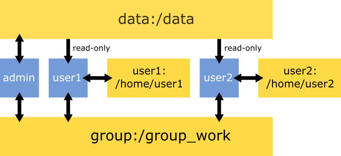

# AWS-docker

Scripts to deploy multiple docker containers simultaneously for teaching.

## Preparation

Start an AWS EC2 instance with an Ubuntu AMI. If you are new to this, [here](https://docs.aws.amazon.com/AWSEC2/latest/UserGuide/concepts.html) is a good place to get started. 

Here's a [repository](https://github.com/GeertvanGeest/terraform-AWS-teaching) that automates the start of an EC2 instance with `terraform`. 

If docker is not pre-installed in your chosen AMI (it is pre-installed in e.g. the [Ubuntu deep learning base AMI](https://aws.amazon.com/marketplace/pp/prodview-dxk3xpeg6znhm)), install docker on the instance:

```sh
curl https://get.docker.com | sh
sudo usermod -a -G docker ubuntu # ubuntu is the user with root access
sudo service docker start
```

You can add the above code to the code run at initialisation. Otherwise, logout and login again to be able use `docker` without `sudo`.

After that, clone this repository:

```sh
git clone https://github.com/GeertvanGeest/AWS-docker.git
```

## Generate credentials

You can generate credentials from a tab-delimited list of users, with four columns: first name, last name, e-mail, instance IP (it's most convenient if your work with an elastic IP that you can reserve before the instance is started). Here's an example:

```
Jan	de Wandelaar	jan.wandel@somedomain.com	18.192.64.150
Piet	Kopstoot	p.kopstoot@anotherdomain.ch	18.192.64.150
Joop	Zoetemelk	joop.zoet@lekkerfietsen.nl	18.192.64.150
```

Run the script `generate_credentials.sh` like this (use `-l` to specify the user list):

```sh
./generate_credentials \
-l examples/user_list_credentials.txt \
-o ./credentials
-p 9001
```

The option `-o` specifies an output directory in which the following files are created:

* `input_docker_start.txt`: A file that serves as input to deploy the docker containers on the server
* `user_info.txt`: A file with user names, passwords and links that can be used to communicate credentials to the participants

The option `-p` is used to generate an individual port for each user. Ports will be assigned in an increasing number from `-p` to each user. So, in the example above, the first user gets port 9001, the second 9002, the third 9003, etc. **Be aware that port 9000 and 10000 are reserved for the admin containers!**

## Deploying containers

Use the script `./generate_credentials.sh` to generate a list of ports, usernames and passwords (or generate it manually otherwise). It should look like this:

```
9001	jdewandelaar	OZDRqwMRmkjKzM48v+I=
9002	pkopstoot	YTnSh6SmhsVUe+aC2HY=
9003	jzoetemelk	LadwVbiYY4rH0S5TjeI=
```

Once deployed, the jupyter notebook or rstudio server will be available through `[HOST IP]:[PORT]`. If you want to have both rstudio server and jupyter notebook running on the same instance, you can generate two tab-delimited files (one for rstudio and one for jupyter) and give them the same passwords for convenience. **Note that each container uses a single port, so the files should contain different ports!**

### Deploy containers based on jupyter notebook

Prepare an image that you want to use for the course. This image should be based on a jupyter notebook container, e.g. [jupyter/base-notebook](https://jupyter-docker-stacks.readthedocs.io/en/latest/using/selecting.html#jupyter-base-notebook), and should be available from `dockerhub`.

Run the script `run_jupyter_notebooks`:

```sh
run_jupyter_notebooks \
-i jupyter/base-notebook \
-u examples/credentials_jupyter/input_docker_start.txt \
-p test1234
```

Here, `-i` is the image tag, `-u` is the user list as generated by `./generate_credentials.sh`, and `-p` is the password for the admin container.
No username is required to log on to a jupyter notebook.

To access the admin container, go to `[HOST IP]:10000`

### Deploy containers based on Rstudio server

Prepare an image that you want to use for the course. This image should be based on a rocker image, e.g. [rocker/rstudio](https://hub.docker.com/r/rocker/rstudio), and should be available from `dockerhub`.

Run the script `run_rstudio_server`:

```sh
run_rstudio_server \
-i rocker/rstudio \
-u examples/credentials_rstudio/input_docker_start.txt \
-p test1234
```

See above for the meaning of the options.

The username to log on to rstudio server is `rstudio`.

To access the admin container, go to `[HOST IP]:9000`

### Deploy containers based on vscode server

Prepare an image that you want to use for the course. This image should be based on a image [linuxserver/code-server](https://hub.docker.com/r/linuxserver/code-server) image, and should be available from `dockerhub`.

In the docker file you can install code-server extensions with `/usr/local/bin/install-extension`. 

Run the script `run_vscode_server`:

```sh
run_vscode_server \
-i linuxserver/code-server \
-u examples/credentials_vscode/input_docker_start.txt \
-p test1234
```

See above for the meaning of the options.

To access the admin container, go to `[HOST IP]:7000`

## Restricting resource usage

To prevent overcommitment of the server, it can be convenient to restrict resource usage per participant. You can do that with the options `-c` and `-m`, which are passed to the arguments `--cpus` and `--memory` of `docker run`. Use it like this:

```sh
run_rstudio_server \
-i rocker/rstudio \
-u examples/credentials_rstudio/input_docker_start.txt \
-p test1234 \
-c 2 \
-m 4g
```

Resulting in a hard limit of 2 cpu and 4 Gb of memory for each user. By default these are 2 cpu and 16 Gb of memory. These restrictions are not applied to the admin container.

## Container & volume infrastructure

There are three volumes mounted to each container:

- The volume `data` is mounted to `/data`. This volume is meant to harbour read-only data (e.g. raw data). 
- The volume `group_work` is mounted to `/group_work`. The group volume is meant as a shared directory, where everybody can read and write.
- Each user has a personal volume, named after the username (output of `generate_credentials`). This volume is mounted to `/home/rstudio/workdir/` for rstudio, `/home/jovyan/workdir` for jupyter, and `/config/workdir` for vscode. 

Below you can find an example of the container infrastructure. Blue squares are containers, yellow are volumes. Arrows indicate accessibility. 



## How to use admin privileges

The admin container (i.e. with sudo rights) is available from port 10000 for the jupyter containers and 9000 for the rstudio containers. The regular users at the ports specified in the tab-delimited text file.

You can check out a user volume with `mount_user_volume.sh`:

```sh
./mount_user_volume.sh user01
```

This will create an ubuntu container directly accessing the home directory of user01. As an alternative to this ubuntu container, you can mount the user volume to any other container.

## Stopping services

You can stop all services (containers and volumes) with the script `stop_services.sh`.

## Setting up a backup

With the script `backup_s3.sh` you can sync files from the docker volumes to s3. It will sync the shared volume `group_work` and the invidual user volumes. In order to run the script, first configure AWS cli on the server:

```
aws configure
```

More info about configuring AWS cli [here](https://docs.aws.amazon.com/cli/latest/userguide/cli-configure-quickstart.html). 

After that, we can specify a cronjob, to sync these files regularly. The script `scripts/backup_s3_cronjob.sh` calls `backup_s3.sh` and can be used in your cronjob. To do this, first edit `scripts/backup_s3_cronjob.sh`:

```sh
#!/usr/bin/env bash

cd /home/ubuntu
AWS-docker/backup_s3 \
-u [CREDENTIALS input_docker_start.txt] \
-s [EXISTING S3 BUCKET] \
-e [DIRECTORY IN THE BUCKET (newly created)] \
2>> cronjob.err
```

Now run:

```sh
crontab -e
```

And add a cronjob. E.g. for every hour you can add this line (use a full path to the cronjob script):

```
0 * * * * /home/ubuntu/backup_s3_cronjob.sh
```


